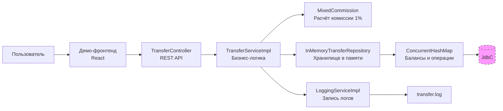

# Money Transfer and Transactional Service(MTSS) - упрошенная реализация программы перевода денежных сумм между банковскими счетами.

## Обзор архитектуры.

# 💸 Money Transfer and Transactional Service (MTSS)

Упрощенная реализация сервиса перевода денежных сумм между банковскими картами.


### Сервис перевода денег с карты на карту

Реализован на Spring Boot с упрощенным in-memory типом данных.  
Реализует двухэтапный перевод с подтверждением по коду и логирование всех операций.

**Поддерживает расчет сложной комиссии** на основе расширяемой архитектуры (абстрактный класс `Commission`, enum `CommissionType`).  
В текущей реализации комиссия зафиксирована на уровне **1%** для соответствия демонстрационному фронтенду.
---
> Примечания

> Сервер не проверяет срок действия и CVV карт (только формат). Для успешного тестирования достаточно передать валидные по формату значения.

> Код подтверждения всегда 0000.

> Валюта зафиксирована как RUB (также принимается RUR).

> Комиссия установлена в размере 1% и согласована с предоставленным фронтендом.
## value — это копейки.
> **Примечание о суммах:** фронтенд отправляет сумму в **копейках** (целое число). Сервер преобразует копейки в рубли BigDecimal (из-за намерения работы с CURENCY, также установлен лимит) с двумя знаками после запятой для внутренних расчётов и хранения балансов.

---

## 🚀 Быстрый старт

### Локально (Maven)
```bash
./mvnw spring-boot:run
---

## 1. Изучение протокола взаимодействия

Сервис предоставляет REST API в соответствии со спецификацией OpenAPI (файл `MoneyTransferServiceSpecification.yaml`).

### Эндпоинты:
| Метод | URL | Описание |
|-------|-----|----------|
| POST | `/transfer` | Создание операции перевода. Возвращает `operationId`. |
| POST | `/confirmOperation` | Подтверждение операции кодом. Выполняет фактическое списание и зачисление средств. |
> **Примечание:** в текущей реализации сервер **не проверяет** срок действия и CVV карт, только их формат. Для успешного тестирования достаточно передать валидные по формату значения.  
> Код подтверждения всегда **0000**.CURRENCY_RUB — валюта фиксирована, её изменение потребует пересмотра фрагментов бизнес‑логики.Каммиссия захардкоржена Front-ендом.

### Формат запросов и ответов
Пример запроса на перевод:
```
📡 API
POST /transfer
```json
{
  "cardFromNumber": "1234567812345678",
  "cardFromValidTill": "12/26",
  "cardFromCVV": "123",
  "cardToNumber": "8765432187654321",
  "amount": {
    "value": 500,
    "currency": "RUB"
  }
}

POST /confirmOperation
json
{
  "operationId": "полученный_id",
  "code": "0000"
}
```
## 2. 🛠 Технологический стэк.


## 3. ⚖️ Управление конфигурацией

Применён смешанный подход: настройки, зависящие от окружения (порт, лимиты, путь к логам), вынесены в `application.yaml`, а статические константы, определяющие API (коды ошибок, валюта, проверочный код), хранятся в классе `ConstantContainer`.

## 4. 🧪 Покрытие тестами

Проект содержит модульные тесты (JUnit 5 + Mockito) для всех ключевых компонентов, а также интеграционные тесты с использованием Testcontainers.
```
In‑memory БД (H2) vs. ConcurrentHashMap (Данный проект- Spring не знает, как откатить изменения в Map)
```



